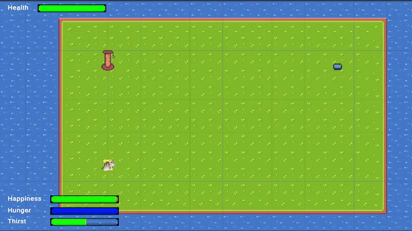

# Cat Simulator (WIP): Nurturing a Self-Sustaining Agent Using Reinforcement Learning

<p align="left">
  
</p>

**This project is in memory of Wilbur, a friend of Ralph Road and a good boy.**

# About this project

Cat Simulator began as my dissertation project during my final year of university. The simulation environment comprises the agent "Wilbur", Wilbur's needs, **Hunger**, **Thirst** & **Happiness** and three regenerative objects, a **Scratching Post**, a **Water Bowl**, and a **Food Bag**. Wilbur will takes steps within his environment (the training area) and with each step his needs will decrease. His desired behaviour is to move between these objects to replenish his needs. The more efficiently he does this, the more rewards he will receive.

<p align="left">
  
</p>

Wilbur's behaviour derives from a reinforcement learning script that I developed using the Unity Machine Learning Agents (ML-Agents) package within the Unity Engine, which you can find [here](https://github.com/Unity-Technologies/ml-agents/tree/release_22). In its current form, Wilbur can only be trained within Unity. Upon pressing play you can observe Wilbur begin knowing nothing about his environment to navigate between the objects and maintain his needs.

# Setting Up

## Cloning this project
To tinker with this project, you must clone this repository and import it into Unity. This guide assumes that you are familiar with the Unity engine. If not, follow [this guide](https://learn.unity.com/tutorial/install-the-unity-hub-and-editor#662942dfedbc2a0315217028) to install the Unity Hub and Editor

In a directory of your choosing, run the following command:

```shell
git clone https://github.com/sunnyCallum/self-sufficient-cat-agent
```

It does not matter where you clone it, just make sure you can locate it within your file explorer.

## Setting up Unity

### Install **Unity 2023.2** or Later

[Download](https://unity3d.com/get-unity/download) and install Unity.
It is recommended to install Unity through the Unity Hub as it will
enable you to manage multiple Unity versions.

### Adding the project to Unity Hub
Launch Unity Hub and click **"Add"** then click **"Add project from disk"**. Your file explorer will open. Navigate to where you cloned this project and add the folder. The project will then appear in your project list.

### Install the `com.unity.ml-agents` Unity package

The Unity ML-Agents C# SDK is a Unity Package. You can install the
`com.unity.ml-agents` package
[directly from the Package Manager registry](https://docs.unity3d.com/Manual/upm-ui-install.html).
Please make sure you enable 'Preview Packages' in the 'Advanced' dropdown in
order to find the latest Preview release of the package.

## Setting up Unity ML-Agents

While the ML-Agents Toolkit installation guide provides comprehensive instructions on how to install the toolkit, I found that this did not work on my Windows machine. I recommend you follow the instructions below to get it working on your machine.

Thank you to [@DDoubleMaster](https://github.com/DDoubleMaster) for providing a solution to the errors encountered. 

### Install **Python 3.9.13**

I recommend [installing](https://www.python.org/downloads/) Python 3.9.13.
If you are using Windows, please install the x86-64 version instead of x86.
If your Python environment doesn't include `pip3`, see these
[instructions](https://packaging.python.org/guides/installing-using-linux-tools/#installing-pip-setuptools-wheel-with-linux-package-managers)
on installing it. It is also recommended to use [Conda](https://docs.conda.io/en/latest/) or [Mamba](https://github.com/mamba-org/mamba) to manage your Python virtual environments. For this guide I will be using **Conda**.

### Conda Python setup

Conda is the virtual environment I used when developing this project. This guide will walk you through installation with a Conda environment. You are free to use
any virtual environment you wish, however, this guide will assume you are using Conda.
<br/><br/>
There are two options for installing Anaconda: `Miniconda`, which is a minimal command-line-based package manager suitable for users who want more control over their installations, and `Anaconda Distribution`, which includes a larger set of pre-installed packages and features a graphical user interface called `Anaconda Navigator` for easier management.
I used `Anaconda Distributor` when developing this project, however `Miniconda` will also suffice for installation.
<br/><br/>
You can install Anaconda Districtor [here](https://docs.anaconda.com/anaconda/install/) and Miniconda [here](https://docs.anaconda.com/miniconda/miniconda-install/)
<br/><br/>
Once conda has been installed in your system, open a terminal and execute the following commands to set up a Python 3.9.13 virtual environment and activate it.

```shell
conda create -n mlagents python=3.9.13 && conda activate mlagents
```

You will see the following output:

```shell
C:\Users\user>conda create -n mlagents python=3.9.13 && conda activate mlagents
Retrieving notices: ...working... done
Channels:
 - defaults
 - conda-forge
Platform: win-64
Collecting package metadata (repodata.json): done
Solving environment: done

## Package Plan ##

  environment location: C:\Users\callu\DevTools\anaconda3\envs\mlagents-test

  added / updated specs:
    - python=3.9.13


The following NEW packages will be INSTALLED:

  ca-certificates    pkgs/main/win-64::ca-certificates-2024.9.24-haa95532_0
  openssl            pkgs/main/win-64::openssl-1.1.1w-h2bbff1b_0
  pip                pkgs/main/win-64::pip-24.2-py39haa95532_0
  python             pkgs/main/win-64::python-3.9.13-h6244533_2
  setuptools         pkgs/main/win-64::setuptools-75.1.0-py39haa95532_0
  sqlite             pkgs/main/win-64::sqlite-3.45.3-h2bbff1b_0
  tzdata             pkgs/main/noarch::tzdata-2024b-h04d1e81_0
  vc                 pkgs/main/win-64::vc-14.40-h2eaa2aa_1
  vs2015_runtime     pkgs/main/win-64::vs2015_runtime-14.40.33807-h98bb1dd_1
  wheel              pkgs/main/win-64::wheel-0.44.0-py39haa95532_0


Proceed ([y]/n)?
```
Input `y`. If you see the following output, your virtual environment was created successfully:

```shell
Downloading and Extracting Packages:

Preparing transaction: done
Verifying transaction: done
Executing transaction: done
#
# To activate this environment, use
#
#     $ conda activate mlagents
#
# To deactivate an active environment, use
#
#     $ conda deactivate
```
Your command line will now have `(mlagents)` before the current working directory. `(mlagents)` means your ML-Agents virtual environment is activated. When deactivated it will display `(base)`. Run `conda activate mlagents` to start your virtual environment and `conda deactivate` to deactivate.


### Upgrade Pip

I recommend upgrading Pip to the latest version to make sure everything runs smoothly.

```shell
python -m pip install --upgrade pip
```

### Install the `mlagents` Python package

Installing the `mlagents` Python package involves installing other Python
packages that `mlagents` depends on. So you may run into installation issues if
your machine has older versions of any of those dependencies already installed.

#### (Windows) Installing PyTorch

On Windows, you'll have to install the PyTorch package separately prior to
installing ML-Agents in order to make sure the cuda-enabled version is used,
rather than the CPU-only version. Activate your virtual environment and run from
the command line:

```sh
pip3 install torch~=2.2.1 --index-url https://download.pytorch.org/whl/cu121
```

Note that on Windows, you may also need Microsoft's
[Visual C++ Redistributable](https://support.microsoft.com/en-us/help/2977003/the-latest-supported-visual-c-downloads)
if you don't have it already. See the [PyTorch installation guide](https://pytorch.org/get-started/locally/)
for more installation options and versions.

Upon successful installation, you will see the following output:

```shell
(mlagents) C:\Users\user>pip3 install torch~=2.2.1 --index-url https://download.pytorch.org/whl/cu121
Looking in indexes: https://download.pytorch.org/whl/cu121
Collecting torch~=2.2.1
  Downloading https://download.pytorch.org/whl/cu121/torch-2.2.2%2Bcu121-cp39-cp39-win_amd64.whl (2454.8 MB)
     ---------------------------------------- 2.5/2.5 GB 7.2 MB/s eta 0:00:00
Collecting filelock (from torch~=2.2.1)
  Using cached https://download.pytorch.org/whl/filelock-3.13.1-py3-none-any.whl (11 kB)
Collecting typing-extensions>=4.8.0 (from torch~=2.2.1)
  Using cached https://download.pytorch.org/whl/typing_extensions-4.9.0-py3-none-any.whl (32 kB)
Collecting sympy (from torch~=2.2.1)
  Using cached https://download.pytorch.org/whl/sympy-1.12-py3-none-any.whl (5.7 MB)
Collecting networkx (from torch~=2.2.1)
  Using cached https://download.pytorch.org/whl/networkx-3.2.1-py3-none-any.whl (1.6 MB)
Collecting jinja2 (from torch~=2.2.1)
  Using cached https://download.pytorch.org/whl/Jinja2-3.1.3-py3-none-any.whl (133 kB)
Collecting fsspec (from torch~=2.2.1)
  Using cached https://download.pytorch.org/whl/fsspec-2024.2.0-py3-none-any.whl (170 kB)
Collecting MarkupSafe>=2.0 (from jinja2->torch~=2.2.1)
  Downloading https://download.pytorch.org/whl/MarkupSafe-2.1.5-cp39-cp39-win_amd64.whl (17 kB)
Collecting mpmath>=0.19 (from sympy->torch~=2.2.1)
  Using cached https://download.pytorch.org/whl/mpmath-1.3.0-py3-none-any.whl (536 kB)
Installing collected packages: mpmath, typing-extensions, sympy, networkx, MarkupSafe, fsspec, filelock, jinja2, torch
Successfully installed MarkupSafe-2.1.5 filelock-3.13.1 fsspec-2024.2.0 jinja2-3.1.3 mpmath-1.3.0 networkx-3.2.1 sympy-1.12 torch-2.2.2+cu121 typing-extensions-4.9.0
```

#### Install **Protobuf 3.20.3**

Note: You need to manually install Protobuf version 3.20.3 as it is a specific dependency required for compatibility with the Unity ML-Agents toolkit.
Using this version ensures optimal performance and functionality within the environment. Run the following command:

```shell
pip install protobuf==3.20.3
```

Successful installation will return this output:

```shell
(mlagents) C:\Users\user>pip install protobuf==3.20.3
Collecting protobuf==3.20.3
  Using cached protobuf-3.20.3-cp39-cp39-win_amd64.whl.metadata (699 bytes)
Using cached protobuf-3.20.3-cp39-cp39-win_amd64.whl (904 kB)
Installing collected packages: protobuf
Successfully installed protobuf-3.20.3
```

#### Install ML-Agents

All that is required to install ML-Agents is to run a single command. This command downloads and installs the necessary package to enable integration with Unity,
allowing you to create and train machine learning agents in your Unity environments.

```shell
pip install mlagents
```
Successful installation will give the following output:

```shell
(mlagents) C:\Users\user>pip install mlagents
Collecting mlagents
  Using cached mlagents-0.30.0-py3-none-any.whl
Collecting grpcio>=1.11.0 (from mlagents)
  Using cached grpcio-1.66.2-cp39-cp39-win_amd64.whl.metadata (4.0 kB)
Collecting h5py>=2.9.0 (from mlagents)
  Using cached h5py-3.12.1-cp39-cp39-win_amd64.whl.metadata (2.5 kB)
Collecting mlagents-envs==0.30.0 (from mlagents)
  Using cached mlagents_envs-0.30.0-py3-none-any.whl
Collecting numpy<2.0,>=1.13.3 (from mlagents)
  Using cached numpy-1.26.4-cp39-cp39-win_amd64.whl.metadata (61 kB)
Collecting Pillow>=4.2.1 (from mlagents)
  Using cached pillow-10.4.0-cp39-cp39-win_amd64.whl.metadata (9.3 kB)
Requirement already satisfied: protobuf>=3.6 in c:\users\callu\devtools\anaconda3\envs\mlagents-test\lib\site-packages (from mlagents) (3.20.3)
Collecting pyyaml>=3.1.0 (from mlagents)
  Using cached PyYAML-6.0.2-cp39-cp39-win_amd64.whl.metadata (2.1 kB)
Collecting tensorboard>=1.15 (from mlagents)
  Using cached tensorboard-2.18.0-py3-none-any.whl.metadata (1.6 kB)
Collecting attrs>=19.3.0 (from mlagents)
  Using cached attrs-24.2.0-py3-none-any.whl.metadata (11 kB)
Collecting pypiwin32==223 (from mlagents)
  Using cached pypiwin32-223-py3-none-any.whl.metadata (236 bytes)
Collecting cattrs<1.7,>=1.1.0 (from mlagents)
  Using cached cattrs-1.5.0-py3-none-any.whl.metadata (16 kB)
Collecting cloudpickle (from mlagents-envs==0.30.0->mlagents)
  Using cached cloudpickle-3.0.0-py3-none-any.whl.metadata (7.0 kB)
Collecting gym>=0.21.0 (from mlagents-envs==0.30.0->mlagents)
  Using cached gym-0.26.2-py3-none-any.whl
Collecting pettingzoo==1.15.0 (from mlagents-envs==0.30.0->mlagents)
  Using cached PettingZoo-1.15.0-py3-none-any.whl
Collecting numpy<2.0,>=1.13.3 (from mlagents)
  Using cached numpy-1.21.2-cp39-cp39-win_amd64.whl.metadata (2.1 kB)
Requirement already satisfied: filelock>=3.4.0 in c:\users\callu\devtools\anaconda3\envs\mlagents-test\lib\site-packages (from mlagents-envs==0.30.0->mlagents) (3.13.1)
Collecting pywin32>=223 (from pypiwin32==223->mlagents)
  Using cached pywin32-307-cp39-cp39-win_amd64.whl.metadata (8.3 kB)
Collecting absl-py>=0.4 (from tensorboard>=1.15->mlagents)
  Using cached absl_py-2.1.0-py3-none-any.whl.metadata (2.3 kB)
Collecting markdown>=2.6.8 (from tensorboard>=1.15->mlagents)
  Using cached Markdown-3.7-py3-none-any.whl.metadata (7.0 kB)
Collecting packaging (from tensorboard>=1.15->mlagents)
  Using cached packaging-24.1-py3-none-any.whl.metadata (3.2 kB)
Requirement already satisfied: setuptools>=41.0.0 in c:\users\callu\devtools\anaconda3\envs\mlagents-test\lib\site-packages (from tensorboard>=1.15->mlagents) (75.1.0)
Collecting six>1.9 (from tensorboard>=1.15->mlagents)
  Using cached six-1.16.0-py2.py3-none-any.whl.metadata (1.8 kB)
Collecting tensorboard-data-server<0.8.0,>=0.7.0 (from tensorboard>=1.15->mlagents)
  Using cached tensorboard_data_server-0.7.2-py3-none-any.whl.metadata (1.1 kB)
Collecting werkzeug>=1.0.1 (from tensorboard>=1.15->mlagents)
  Using cached werkzeug-3.0.4-py3-none-any.whl.metadata (3.7 kB)
Collecting gym-notices>=0.0.4 (from gym>=0.21.0->mlagents-envs==0.30.0->mlagents)
  Using cached gym_notices-0.0.8-py3-none-any.whl.metadata (1.0 kB)
Collecting importlib-metadata>=4.8.0 (from gym>=0.21.0->mlagents-envs==0.30.0->mlagents)
  Using cached importlib_metadata-8.5.0-py3-none-any.whl.metadata (4.8 kB)
Requirement already satisfied: MarkupSafe>=2.1.1 in c:\users\callu\devtools\anaconda3\envs\mlagents-test\lib\site-packages (from werkzeug>=1.0.1->tensorboard>=1.15->mlagents) (2.1.5)
Collecting zipp>=3.20 (from importlib-metadata>=4.8.0->gym>=0.21.0->mlagents-envs==0.30.0->mlagents)
  Using cached zipp-3.20.2-py3-none-any.whl.metadata (3.7 kB)
Using cached numpy-1.21.2-cp39-cp39-win_amd64.whl (14.0 MB)
Using cached pypiwin32-223-py3-none-any.whl (1.7 kB)
Using cached attrs-24.2.0-py3-none-any.whl (63 kB)
Using cached cattrs-1.5.0-py3-none-any.whl (19 kB)
Using cached grpcio-1.66.2-cp39-cp39-win_amd64.whl (4.3 MB)
Using cached h5py-3.12.1-cp39-cp39-win_amd64.whl (3.0 MB)
Using cached pillow-10.4.0-cp39-cp39-win_amd64.whl (2.6 MB)
Using cached PyYAML-6.0.2-cp39-cp39-win_amd64.whl (162 kB)
Using cached tensorboard-2.18.0-py3-none-any.whl (5.5 MB)
Using cached absl_py-2.1.0-py3-none-any.whl (133 kB)
Using cached cloudpickle-3.0.0-py3-none-any.whl (20 kB)
Using cached Markdown-3.7-py3-none-any.whl (106 kB)
Using cached pywin32-307-cp39-cp39-win_amd64.whl (6.6 MB)
Using cached six-1.16.0-py2.py3-none-any.whl (11 kB)
Using cached tensorboard_data_server-0.7.2-py3-none-any.whl (2.4 kB)
Using cached werkzeug-3.0.4-py3-none-any.whl (227 kB)
Using cached packaging-24.1-py3-none-any.whl (53 kB)
Using cached gym_notices-0.0.8-py3-none-any.whl (3.0 kB)
Using cached importlib_metadata-8.5.0-py3-none-any.whl (26 kB)
Using cached zipp-3.20.2-py3-none-any.whl (9.2 kB)
Installing collected packages: pywin32, gym-notices, zipp, werkzeug, tensorboard-data-server, six, pyyaml, pypiwin32, Pillow, packaging, numpy, grpcio, cloudpickle, attrs, absl-py, importlib-metadata, h5py, cattrs, markdown, gym, tensorboard, pettingzoo, mlagents-envs, mlagents
Successfully installed Pillow-10.4.0 absl-py-2.1.0 attrs-24.2.0 cattrs-1.5.0 cloudpickle-3.0.0 grpcio-1.66.2 gym-0.26.2 gym-notices-0.0.8 h5py-3.12.1 importlib-metadata-8.5.0 markdown-3.7 mlagents-0.30.0 mlagents-envs-0.30.0 numpy-1.21.2 packaging-24.1 pettingzoo-1.15.0 pypiwin32-223 pywin32-307 pyyaml-6.0.2 six-1.16.0 tensorboard-2.18.0 tensorboard-data-server-0.7.2 werkzeug-3.0.4 zipp-3.20.2
```

To verify if your ML-Agents installation was successful, you can run the following command:

```shell
mlagents-learn -h
```

If you see a list of commands, Unity ML-Agents has been successfully installed onto your virtual environment!

## Training Wilbur

Once ML-Agents has been installed onto your machine, you can begin training Wilbur's agent by following these instructions:
<br/>
1. Open a command or terminal window.
2. Run `conda activate mlagents` to activate the virtual env.
3. Navigate (CD) to the folder where you cloned this project repository.
4. Run `mlagents-learn config/cat_config.yaml --run-id=firstWilburRun`.
 - `config/cat_config.yaml` is the path to Wilbur's config file.
 - `run-id` is a unique name for this training session.
4. When the following output is displayed in your terminal, you can press the Play button in Unity to start training in the Editor:

  ```shell
     (mlagents) C:\Code Projects\Unity\self-sufficient-cat-agent>mlagents-learn config/cat_config.yaml --run-id=firstWilburRun
      C:\Users\user\anaconda3\envs\mlagents-test\lib\site-packages\torch\__init__.py:696: UserWarning: torch.set_default_tensor_type() is deprecated as of PyTorch 2.1, please use torch.set_default_dtype() and       torch.set_default_device() as alternatives. (Triggered internally at C:\actions-runner\_work\pytorch\pytorch\builder\windows\pytorch\torch\csrc\tensor\python_tensor.cpp:453.)
        _C._set_default_tensor_type(t)
      
                  ┐  ╖
              ╓╖╬│╡  ││╬╖╖
          ╓╖╬│││││┘  ╬│││││╬╖
       ╖╬│││││╬╜        ╙╬│││││╖╖                               ╗╗╗
       ╬╬╬╬╖││╦╖        ╖╬││╗╣╣╣╬      ╟╣╣╬    ╟╣╣╣             ╜╜╜  ╟╣╣
       ╬╬╬╬╬╬╬╬╖│╬╖╖╓╬╪│╓╣╣╣╣╣╣╣╬      ╟╣╣╬    ╟╣╣╣ ╒╣╣╖╗╣╣╣╗   ╣╣╣ ╣╣╣╣╣╣ ╟╣╣╖   ╣╣╣
       ╬╬╬╬┐  ╙╬╬╬╬│╓╣╣╣╝╜  ╫╣╣╣╬      ╟╣╣╬    ╟╣╣╣ ╟╣╣╣╙ ╙╣╣╣  ╣╣╣ ╙╟╣╣╜╙  ╫╣╣  ╟╣╣
       ╬╬╬╬┐     ╙╬╬╣╣      ╫╣╣╣╬      ╟╣╣╬    ╟╣╣╣ ╟╣╣╬   ╣╣╣  ╣╣╣  ╟╣╣     ╣╣╣┌╣╣╜
       ╬╬╬╜       ╬╬╣╣      ╙╝╣╣╬      ╙╣╣╣╗╖╓╗╣╣╣╜ ╟╣╣╬   ╣╣╣  ╣╣╣  ╟╣╣╦╓    ╣╣╣╣╣
       ╙   ╓╦╖    ╬╬╣╣   ╓╗╗╖            ╙╝╣╣╣╣╝╜   ╘╝╝╜   ╝╝╝  ╝╝╝   ╙╣╣╣    ╟╣╣╣
         ╩╬╬╬╬╬╬╦╦╬╬╣╣╗╣╣╣╣╣╣╣╝                                             ╫╣╣╣╣
            ╙╬╬╬╬╬╬╬╣╣╣╣╣╣╝╜
                ╙╬╬╬╣╣╣╜
                   ╙
      
       Version information:
        ml-agents: 0.30.0,
        ml-agents-envs: 0.30.0,
        Communicator API: 1.5.0,
        PyTorch: 2.2.2+cu121
      C:\Users\user\anaconda3\envs\mlagents-test\lib\site-packages\torch\__init__.py:696: UserWarning: torch.set_default_tensor_type() is deprecated as of PyTorch 2.1, please use torch.set_default_dtype() and torch.set_default_device() as alternatives. (Triggered internally at C:\actions-runner\_work\pytorch\pytorch\builder\windows\pytorch\torch\csrc\tensor\python_tensor.cpp:453.)
        _C._set_default_tensor_type(t)
      [INFO] Listening on port 5004. Start training by pressing the Play button in the Unity Editor.
  ```

Once a training session has been completed, the results will be saved to the `results` directory.

## (Optional) Observing training using TensorBoard

The ML-Agents Toolkit saves statistics during learning sessions that you can view with a TensorFlow utility named, [TensorBoard](https://www.tensorflow.org/tensorboard).

The `mlagents-learn` command saves training statistics to a folder named results, organized by the `run-id` value you assign to a training session.

To observe the training process, either during training or afterwards, you first must install `tensorboard` onto the virtual environment. With your `mlagents` virtual env activated, run the following command:

```shell
pip install tensorboard
```

Successful installation will produce the following output:

```shell
(mlagents) C:\Code Projects\Unity\self-sufficient-cat-agent>pip install tensorboard
Requirement already satisfied: tensorboard in c:\users\user\anaconda3\envs\mlagents\lib\site-packages (2.18.0)
Requirement already satisfied: absl-py>=0.4 in c:\users\user\anaconda3\envs\mlagents\lib\site-packages (from tensorboard) (2.1.0)
Requirement already satisfied: grpcio>=1.48.2 in c:\users\user\anaconda3\envs\mlagents\lib\site-packages (from tensorboard) (1.66.2)
Requirement already satisfied: markdown>=2.6.8 in c:\users\user\anaconda3\envs\mlagents\lib\site-packages (from tensorboard) (3.7)
Requirement already satisfied: numpy>=1.12.0 in c:\users\user\anaconda3\envs\mlagents\lib\site-packages (from tensorboard) (1.21.2)
Requirement already satisfied: packaging in c:\users\user\anaconda3\envs\mlagents\lib\site-packages (from tensorboard) (24.1)
Requirement already satisfied: protobuf!=4.24.0,>=3.19.6 in c:\users\user\anaconda3\envs\mlagents\lib\site-packages (from tensorboard) (3.20.3)
Requirement already satisfied: setuptools>=41.0.0 in c:\users\user\anaconda3\envs\mlagents\lib\site-packages (from tensorboard) (75.1.0)
Requirement already satisfied: six>1.9 in c:\users\user\anaconda3\envs\mlagents\lib\site-packages (from tensorboard) (1.16.0)
Requirement already satisfied: tensorboard-data-server<0.8.0,>=0.7.0 in c:\users\user\anaconda3\envs\mlagents\lib\site-packages (from tensorboard) (0.7.2)
Requirement already satisfied: werkzeug>=1.0.1 in c:\users\user\anaconda3\envs\mlagents\lib\site-packages (from tensorboard) (3.0.4)
Requirement already satisfied: importlib-metadata>=4.4 in c:\users\user\anaconda3\envs\mlagents\lib\site-packages (from markdown>=2.6.8->tensorboard) (8.5.0)
Requirement already satisfied: MarkupSafe>=2.1.1 in c:\users\user\anaconda3\envs\mlagents\lib\site-packages (from werkzeug>=1.0.1->tensorboard) (2.1.5)
Requirement already satisfied: zipp>=3.20 in c:\users\user\anaconda3\envs\mlagents\lib\site-packages (from importlib-metadata>=4.4->markdown>=2.6.8->tensorboard) (3.20.2)
```

Now that `tensorboard` is installed, open a terminal or console window:
1. Navigate to the directory where you cloned this project
2. From the command line run: `tensorboard --logdir results --port 6006`
3. Open a browser window and navigate to `localhost:6006`.

*Note*: The default port TensorBoard uses is 6006. If there is an existing session running on port 6006 a new session can be launched on an open port using the --port option.
